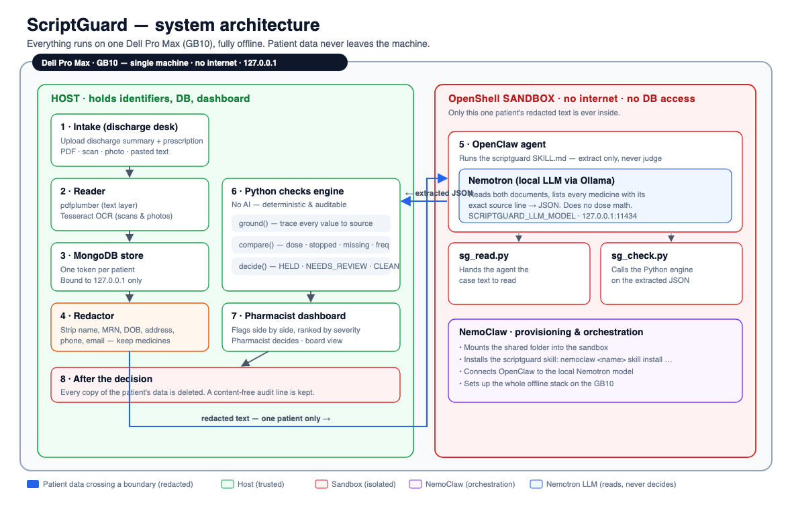
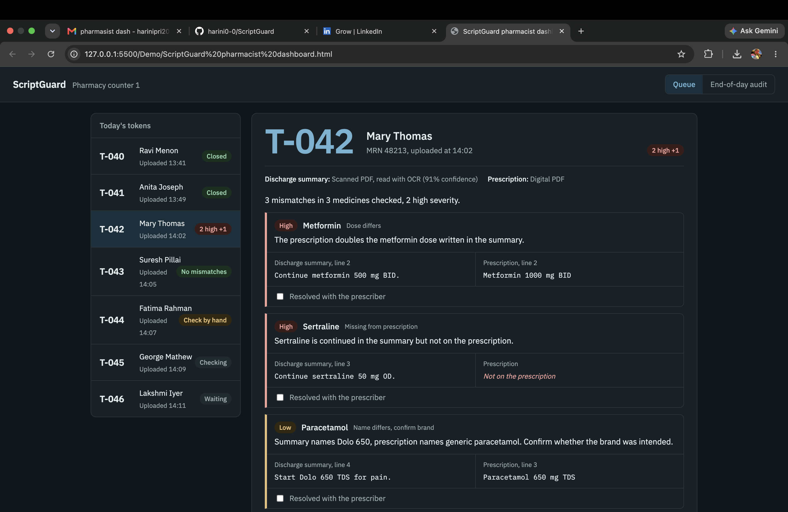
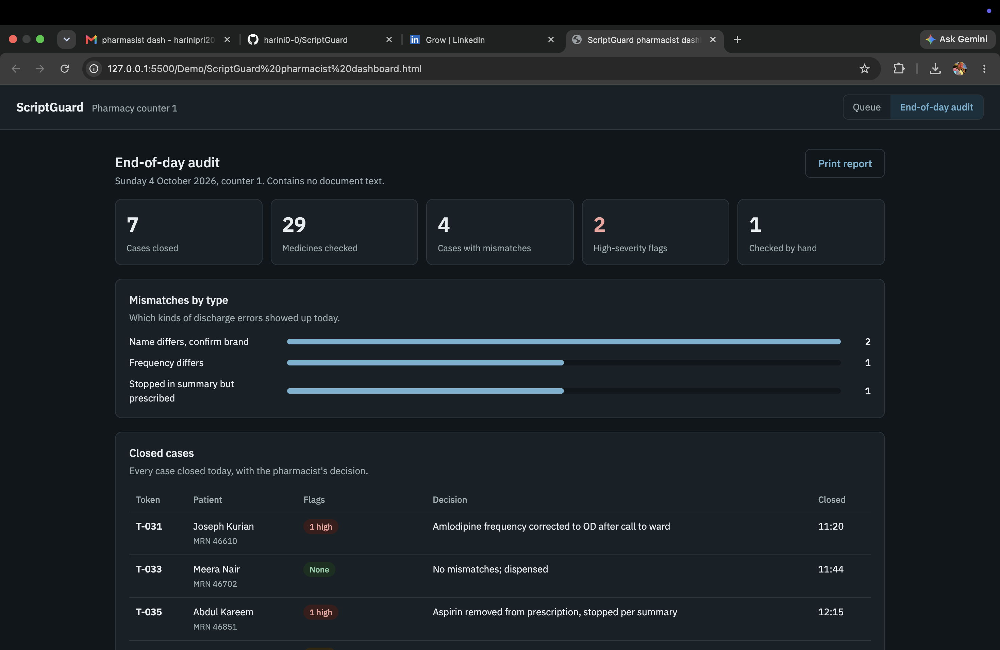
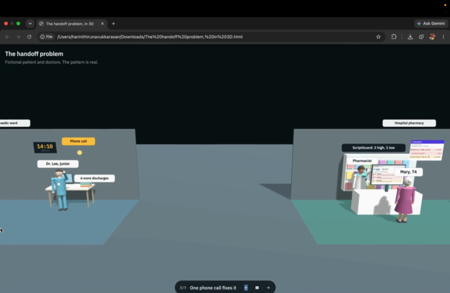
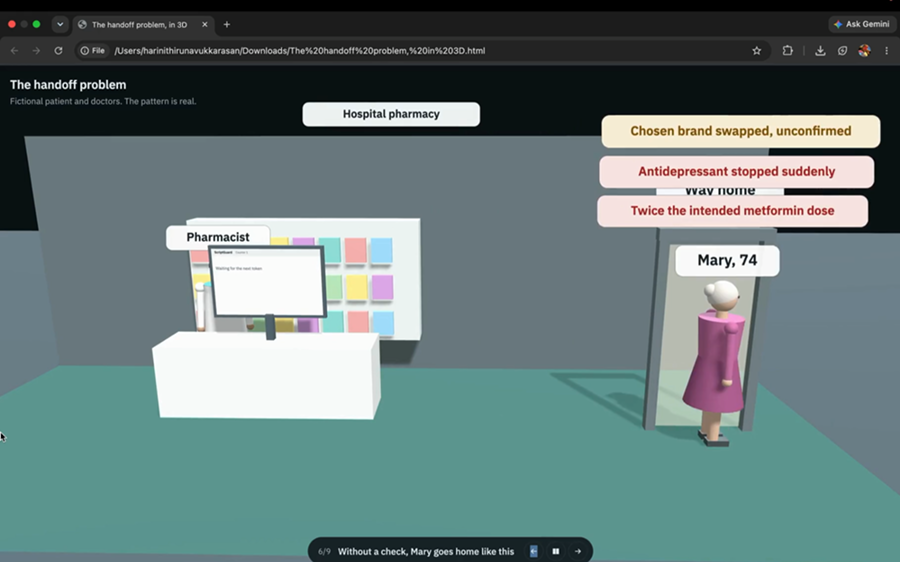
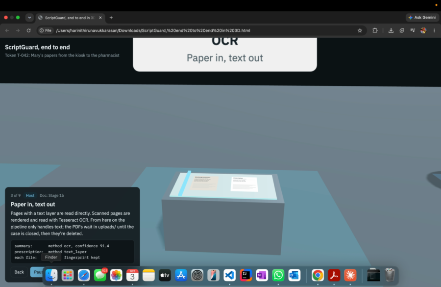

# ScriptGuard

**A private, offline AI safety net for discharge medication mismatches.**
Built at the Dell × NVIDIA AI Hackathon, Boston — October 2026.

ScriptGuard reads a patient's discharge summary and discharge prescription (PDF, scan, photo, or
pasted text), finds every medication mismatch between them, holds the order, and shows the
pharmacist exactly which lines conflict — ranked by severity, before the patient goes home.

Everything runs locally on a single Dell Pro Max with GB10. **Patient data never leaves the machine.**

> **The AI reads. Python decides. The pharmacist approves.**

---

## The problem

When a patient leaves hospital, two documents go out: a **discharge summary** describing the
treatment plan, and a **prescription** telling the pharmacy what to dispense. They are supposed to
say the same thing. Often they are written by different people — a senior doctor writes the summary,
a junior doctor writes the prescription at the end of a long shift. Things get lost in that handoff:
a dose changes, a drug disappears, a chosen brand becomes a generic.

*Mary, 74, is discharged after a hip operation. The summary says continue metformin 500 mg twice
daily, continue sertraline 50 mg once daily, start Dolo 650 for pain. The prescription says metformin
**1000 mg** twice daily, paracetamol 650 mg — and sertraline never makes it onto the prescription at
all. Nobody notices.* ScriptGuard catches all three within seconds of the files being saved: two
high-severity flags and one low-severity "confirm brand" flag. The pharmacist calls the ward and
fixes the order before Mary goes home.

---

## How it works

1. **Intake (host).** Documents are read (PDF text layer, or Tesseract OCR for scans and photos) and
   stored in MongoDB under a token. Patient identifiers are captured at intake.
2. **Redaction + handoff.** The token is called automatically. Only that one patient's text, with
   identifiers redacted, enters the NVIDIA **OpenShell** sandbox — no internet, no database access.
3. **Extraction (local AI).** A local **Nemotron** model extracts each medicine with its exact source
   line (via an **OpenClaw** agent running the `scriptguard` skill under **NemoClaw**).
4. **Checking (Python, no AI).** Deterministic checks: grounding every value back to the source text,
   then dose / stopped / missing / frequency / brand comparisons. The model never judges safety.
5. **Pharmacist review.** The pharmacist sees the flags side by side and decides. All patient data is
   then deleted; a content-free audit line is kept.

```
intake / OCR ──▶ MongoDB (host) ──▶ redact ──▶ OpenShell sandbox ──▶ Nemotron extract
                                                                          │
pharmacist dashboard ◀── Python checks (ground → compare → decide) ◀──────┘
```

Three decision states: **HELD** (a mismatch was found — order held for review), **NEEDS_REVIEW**
(a value could not be read reliably — check by hand), and **CLEAN** (no discrepancies found).

---

## Architecture

The whole stack runs on a single Dell Pro Max (GB10), with no internet access. The **host** holds
patient identifiers, the database, and the pharmacist dashboard. **NemoClaw** provisions the offline
stack and installs the skill. **OpenShell** gives the agent an isolated sandbox with no internet and
no database access. Inside it, an **OpenClaw** agent runs the `scriptguard` skill and uses a local
**Nemotron** model (via Ollama) to *read* the documents — it never decides anything. The only data
that ever crosses into the sandbox is one patient's text, with identifiers already redacted.



| Component | Where | Role |
|---|---|---|
| **NemoClaw** | Host | Sets up the offline stack, mounts the shared folder, installs the `scriptguard` skill, connects the agent to the local model. |
| **OpenShell** | — | The sandbox boundary: no internet, no database access. Only redacted, single-patient text enters. |
| **OpenClaw agent** | Sandbox | Runs `SKILL.md` — extracts every medicine with its exact source line, and nothing else. |
| **Nemotron** (Ollama) | Sandbox | The local LLM that reads the documents. It lists medicines; it never compares doses or judges safety. |
| **Python checks engine** | Host | `ground → compare → decide`. Deterministic, auditable, no AI. Produces the verdict. |
| **MongoDB** | Host | Per-token patient store, bound to `127.0.0.1`. Deleted after the pharmacist decides. |
| **Dashboard / intake / board** | Host | Discharge-desk intake, the pharmacist's flag review, and the waiting-room board. |

---

## The pharmacist's view

A live queue of today's tokens with a per-patient breakdown of every flag — showing the exact
discharge-summary line next to the exact prescription line — plus an end-of-day audit that contains
**no document text**, only decisions and counts.





---

## Demo

### Watch

Click a thumbnail to play the video (the files live in [`Demo/`](Demo/)):

<table>
<tr>
<td width="33%" align="center">
<a href="Demo/Full_demo.mov"></a><br>
<b>Full demo</b> · ~2:20<br>
<sub>The product end to end: intake → sandbox → checks → pharmacist decision.</sub>
</td>
<td width="33%" align="center">
<a href="Demo/3D_ProbStat.mp4"></a><br>
<b>The problem</b> · ~2:00<br>
<sub>Why discharge-summary vs prescription mismatches happen, visualized.</sub>
</td>
<td width="33%" align="center">
<a href="Demo/3D_Solution.mov"></a><br>
<b>The solution in 3D</b> · ~1:20<br>
<sub>How ScriptGuard reads, checks, and flags — the data flow, animated.</sub>
</td>
</tr>
</table>

> The `.mov` clips are large (`Full_demo.mov` ≈ 165 MB, `3D_Solution.mov` ≈ 105 MB) and exceed
> GitHub's 100 MB per-file limit. To view them on GitHub, track them with
> [Git LFS](https://git-lfs.com/); otherwise open them locally from the `Demo/` folder.
> The `3D_ProbStat.mp4` clip (≈ 13 MB) commits normally.

### Interactive 3D explainers (run live in the browser)

These are real-time three.js animations — the same content as the `.mov` clips above, but
interactive. A README can't run them inline (GitHub strips the scripts), so the **Open live** links
render the page live through a preview proxy. No download, no repo setup.

| Explainer | Open live | What it is |
|---|---|---|
| **The handoff problem, in 3D** | [▶ open](https://raw.githack.com/harini0-0/ScriptGuard/main/Demo/The%20handoff%20problem%2C%20in%203D.html) | Interactive walkthrough of how a dose, a drug, or a brand gets lost between the two documents. |
| **ScriptGuard, end to end in 3D** | [▶ open](https://raw.githack.com/harini0-0/ScriptGuard/main/Demo/ScriptGuard%2C%20end%20to%20end%20in%203D.html) | Interactive view of the full pipeline, from filing the documents to the pharmacist's verdict. |
| **Pharmacist dashboard (mockup)** | [▶ open](https://raw.githack.com/harini0-0/ScriptGuard/main/Demo/ScriptGuard%20pharmacist%20dashboard.html) | Self-contained mockup of the pharmacist dashboard. |

> **Live links need the files pushed to `main` first** (the proxy fetches them from GitHub). They
> load three.js and fonts from public CDNs, so an internet connection is required to view them — the
> animations themselves still run fully offline in the real demo.
> For permanent URLs, enable **GitHub Pages** (Settings → Pages → deploy from `main`); the pages then
> live at `https://harini0-0.github.io/ScriptGuard/Demo/...`.
> To view locally instead, just open any `Demo/*.html` file in a browser.

### More materials (in [`Demo/`](Demo/))

| File | What it is |
|---|---|
| [`ScriptGuard_ pitch, analysis and 4-hour build plan.html`](Demo/ScriptGuard_%20pitch,%20analysis%20and%204-hour%20build%20plan.html) | The full pitch: 30-second version, the on-stage story, the analysis, and the hackathon build plan. |
| [`Script.pdf`](Demo/Script.pdf) | The presentation script read on stage. |
| [`MVP.pdf`](Demo/MVP.pdf) | The MVP write-up — scope, approach, and what was built. |
| [`ScriptGuard_Pitch.key`](ScriptGuard_Pitch.key) | Keynote pitch deck (at the repo root). |
| [`Pharma_Dash.png`](Demo/Pharma_Dash.png) · [`Audit_report.png`](Demo/Audit_report.png) | Dashboard screenshots used above. |
| [`architecture.svg`](Demo/architecture.svg) · [`architecture.png`](Demo/architecture.png) | The architecture diagram shown above (editable SVG + rendered PNG). |

---

## Verification (synthetic data)

| What we tested | Result |
|---|---|
| Checking logic — 15 planted errors across 19 cases | **15/15 caught, 100% specificity** |
| Reading scans — 105 medication lines | **97% exact, 99% with every dose number correct** |
| Identifier redaction before the sandbox | **0% leaked, 100% of medicines kept** |

Full methodology, metrics, and limitations:
[verification/reports/VERIFICATION_REPORT.md](verification/reports/VERIFICATION_REPORT.md)

The verification harness **reads** the product code and never modifies it, so the numbers describe
exactly what runs in the demo. All documents are synthetic (fictional hospitals and patients).

---

## Stack

NemoClaw · OpenClaw · OpenShell (NVIDIA) · Ollama (Nemotron) · Python · Tesseract OCR · MongoDB

---

## Run

```bash
# 1. Mount the sandbox and install the skill
nemoclaw <name> share mount /sandbox ~/sbx
cp -r scriptguard2 ~/sbx/ && nemoclaw <name> skill install ~/sbx/scriptguard2

# 2. MongoDB (host only, bound to 127.0.0.1)
docker run -d --name scriptguard-mongo -p 127.0.0.1:27017:27017 mongo:7

# 3. Host server
SG2_SANDBOX=~/sbx/scriptguard2 python3 sg2_host/server.py
```

| View | URL |
|---|---|
| Pharmacist dashboard | http://localhost:8600/ |
| Intake (discharge desk) | http://localhost:8600/intake |
| Waiting-room board | http://localhost:8600/board |

Host prerequisites: `tesseract-ocr`, `poppler-utils`, and the Python packages `pymongo`,
`pdfplumber`, `pytesseract`, `pillow`. The model name and endpoint are set with
`SCRIPTGUARD_LLM_MODEL` (default `nemotron-light:latest`) and `SCRIPTGUARD_LLM_URL`
(default `http://127.0.0.1:11434/v1`).

---

## Layout

```
scriptguard2/     Engine, real-world layer, agent tools, SKILL.md — copied INTO the sandbox. No patient data.
  engine/scriptguard/   ingest → extract → ground → compare → pipeline (two stages: extract, then check)
  tools/                sg_read.py (read a case), sg_check.py (ground + compare + decide)
  SKILL.md              the OpenClaw agent's instructions: extract only, never judge
sg2_host/         Stays on the HOST — server, dashboard/intake/board pages, OCR, MongoDB store, demo docs
verification/     Test suites (A–E), synthetic test data, answer key, and the verification report
Demo/             Walkthrough videos, 3D explainers, pitch, dashboard mockup, screenshots
```

Runtime state (`sg2_host/data/`, sandbox `cases/ work/ results/`, `mongo-data/`) is git-ignored and
never committed. See [README_v2.md](README_v2.md) and [README_v3.md](README_v3.md) for earlier
Streamlit/HTTP setup notes.

---

All data is synthetic (fictional hospitals and patients). **Prototype, not a clinical tool** —
validate on de-identified real data before any deployment.
